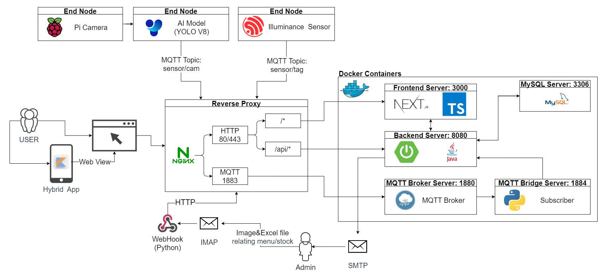

# **eatingSSAFY**

### Problem Statement

   In multicampus, 212, Teheran-ro, Gangnam-gu, Seoul, Republic of Korea, people frequently suffer from difficulty in taking stock of food serving on the 10th floor. This is because of too long process of reporting the stock. The process is described below.

1. A nutritionist working on floor 10 reports the stock to a manager of multicampus in real-time.

2. The manager then reports the stock to the leaders of each classroom.

3. Then, leaders report the stock to all classrooms.

Therefore, a service that display the stock of food serving on the 10th floor in real-time is highly required.

### Project Overview

   The number of salads and sandwiches in a refrigerator is detected by a raspberry camera attached above the refrigerator. The Artificial Intelligence(AI) model conducted in the camera identifies whether a food is taken out or in as well as whether it is a salad or a sandwich. However, since lunch boxes are placed outside the refrigerator, the number of lunch boxes is calculated by a difference between the total number of people receiving food and the quantity of salads and sandwiches taken out. Thus, people who tag a card in a card reader and people who do not bring a card should be recognized. Illuminance sensor is used in discerning tagging and digital form is utilized in order not only to collect the information of people without cards but also to count those people. This whole process is conducted in a real-time and consequently, the number of food on the 10th floor is shown to users. 

### Novelty

- Implementation of registering menu and stock automatically through WebHook
- CV deep learning model
- Server-side rendering using NextJS

### System Architecture

---

### Server setting

1. Docker Setting
    1. Install docker/docker-compose
    2. Make `.env` file (It's written in [notion](https://www.notion.so/ondol1224/env-file-03e2b69608af490ca177a51bff633fd8?pvs=4))
    3. Set `.env` to read in docker: `docker-compose --env-file .env config`
    4. `docker-compose up -d`