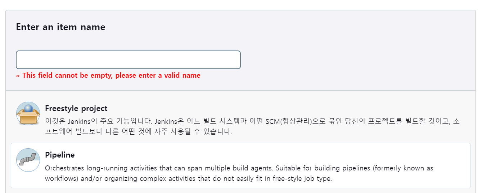

# Porting Manual

## Jenkins setting

### Install

1. Add Jenkins repository

```bash
curl -fsSL https://pkg.jenkins.io/debian/jenkins.io-2023.key | sudo tee \
  /usr/share/keyrings/jenkins-keyring.asc > /dev/null
echo deb [signed-by=/usr/share/keyrings/jenkins-keyring.asc] \
  https://pkg.jenkins.io/debian binary/ | sudo tee \
  /etc/apt/sources.list.d/jenkins.list > /dev/null
```

2. Update and upgrade apt

```bash
sudo apt update
sudo apt upgrade
```

3. Install Jenkins

```bash
sudo apt install jenkins
```

4. Switch port (original port is set as 8080)

```bash
sudo vi /etc/sysconfig/jenkins

# JENKINS_PORT="" already exits. Change the port instead of 8080.
# eatingSSAFY use 27017 port which is opened by default in the firewall.
JENKINS_PORT="27017"
```

5. Initialize setting in `${ip}:${port}`

Refer to `/var/lib/jenkins/secrets/initialAdminPassword` for initial password directory.

### Add Plugin

- **[Build Timeout](https://plugins.jenkins.io/build-timeout)**
- **[Command Agent Launcher Plugin](https://plugins.jenkins.io/command-launcher)**
- **[Discard Old Build plugin](https://plugins.jenkins.io/discard-old-build)**
- **[Email Extension Plugin](https://plugins.jenkins.io/email-ext)**
- **[Generic Webhook Trigger Plugin](https://plugins.jenkins.io/generic-webhook-trigger)**
- **[GitHub Branch Source Plugin](https://plugins.jenkins.io/github-branch-source)**
- **[GitLab API Plugin](https://plugins.jenkins.io/gitlab-api)**
- **[GitLab Plugin](https://plugins.jenkins.io/gitlab-plugin)**
- **[Gradle](https://plugins.jenkins.io/gradle)**
- **[JavaMail API](https://plugins.jenkins.io/javax-mail-api)**
- **[LDAP Plugin](https://plugins.jenkins.io/ldap)**
- **[Matrix Authorization Strategy Plugin](https://plugins.jenkins.io/matrix-auth)**
- **[MySQL Database Plugin](https://plugins.jenkins.io/database-mysql)**
- **[NodeJS Plugin](https://plugins.jenkins.io/nodejs)**
- **[Oracle Java SE Development Kit Installer Plugin](https://plugins.jenkins.io/jdk-tool)**
- **[PAM Authentication plugin](https://plugins.jenkins.io/pam-auth)**
- **[Pipeline](https://plugins.jenkins.io/workflow-aggregator)**
- **[Pipeline: GitHub Groovy Libraries](https://plugins.jenkins.io/pipeline-github-lib)**
- **[Pipeline: Stage View Plugin](https://plugins.jenkins.io/pipeline-stage-view)**
- **[Publish Over SSH](https://plugins.jenkins.io/publish-over-ssh)**
- **[SSH Build Agents plugin](https://plugins.jenkins.io/ssh-slaves)**
- **[SSH server](https://plugins.jenkins.io/sshd)**
- **[Timestamper](https://plugins.jenkins.io/timestamper)**
- **[Workspace Cleanup Plugin](https://plugins.jenkins.io/ws-cleanup)**

### Managing Jenkins > Credentials Setting

Add credential information by linking with gitlab.

### Managing Jenkins > System Setting > Global properties

- BACKEND_HOST
- BACKEND_PORT
- BRIDGE_PORT
- BROKER_HOST
- BROKER_PORT
- DB_HOST
- DB_NAME
- DB_PASSWORD
- DB_ROOT_PASSWORD
- DB_USER_NAME
- KAKAO_API_KEY
- KAKAO_CLIENT_SECRET
- KAKAO_REDIRECT_URI
- MAIL_PASSWORD
- MAIL_USERNAME
- OCR_REQUEST_URL
- OCR_SECRET_KEY
- RESOURCE_DIR

### Pipeline Setting

1. Add `New Item` in Jenkins Console
2. Create Pipeline



1) Composition
- GitLab Connection: same as `Credentials setting`
- Delete old builds
    - Period of Build history retention: 10
    - Maximum number of store: 10
    
2) Pipeline Script
    - Refer to [Script](./script/jenkins_pipeline.txt) 

### Place fcm-service-account.json file in Jenkins server

eatingSSAFY use FCM Firebase Cloud Messaging service in order to implement a mobile applicaion push notification service. Download service-account.json file from Firebase Cloud Server and change a name of the file to `fcm-service-account.json`. Place the file in the eatingSSAFY directory located under the Jenkins home directory.

```bash
ubuntu:/var/lib/jenkins/eatingssafy$ ls -al
total 12
drwxrwxrwx  2 ubuntu  ubuntu  4096 Feb 10 14:24 .
drwxrwxrwx 23 jenkins jenkins 4096 Feb 15 11:20 ..
-rw-rw-rw-  1 ubuntu  ubuntu  2391 Feb 10 14:24 fcm-service-account.json
```

## Nginx

### Install

1. Install Service

```bash
sudo apt install nginx
```

2. Check firewall settings

```bash
sudo ufw app list
```

3. Check service running

```bash
sudo service nginx status

## Check 'Active: active'
## example:
● nginx.service - A high performance web server and a reverse proxy server
     Loaded: loaded (/lib/systemd/system/nginx.service; enabled; vendor preset: enabled)
     Active: active (running) since Wed 2024-02-14 10:36:23 KST; 24h ago
       Docs: man:nginx(8)
   Main PID: 296339 (nginx)
      Tasks: 5 (limit: 19165)
     Memory: 14.9M
     CGroup: /system.slice/nginx.service
             ├─296339 nginx: master process /usr/sbin/nginx -g daemon on; master_process on;
             ├─296340 nginx: worker process
             ├─296341 nginx: worker process
             ├─296342 nginx: worker process
             └─296343 nginx: worker process
```

### Write conf file

1. Comment out the default file

```bash
sudo vi /etc/nginx/site-enabled/default
# Comment out all the contents
```

2. Add mqtt setting in nginx.conf file

```bash
sudo vi /etc/nginx/nginx.conf

# Add the following content to the bottom of the file
stream {
        server {
                listen 1883;
                proxy_pass 127.0.0.1:1880;
        }
}
```

3. Add service conf file

```bash
sudo vi /etc/nginx/site-available/eatingssafy
```
Refer to [conf](./script/eatingssafy.conf) for information to add at the bottom.

4. conf file error verification

```bash
sudo nginx -t
```

### nginx restart

```bash
sudo service nginx restart
```

## Database setting

As you start the first build with Jenkins, the database server starts up. However, Spring Boot crashes as soon as it starts because the JPA of the backend server is set to `validate` as default. Therefore, [data.sql](https://lab.ssafy.com/s10-webmobile3-sub2/S10P12A204/-/blob/master/backend/eatingSSAFY/src/main/resources/data.sql?ref_type=heads) and [xxxx_xx_lunch_time.sql](https://lab.ssafy.com/s10-webmobile3-sub2/S10P12A204/-/blob/master/backend/eatingSSAFY/src/main/resources/2024_ss_lunch_time.sql?ref_type=heads) files should be placed in a home directory on the EC2 server and injected into the database.eatingssafy. 

```bash
ubuntu@ip-172-26-6-85:~$ ls -al | grep .sql
-rw-rw-r--  1 ubuntu ubuntu  9956 Feb  8 09:54 2024_ss_lunch_time.sql
-rw-rw-r--  1 ubuntu ubuntu  7134 Feb 14 18:03 data.sql

# After checking the location of the file
# Create the table and Insert allergy information
mysql -ua204 -p -h127.0.0.1 -Deatingssafy < data.sql

# Insert lunch_time information
mysql -ua204 -p -h127.0.0.1 -Deatingssafy < 2024_ss_lunch_time.sql
```

## External service usage information

### 1. [Zapier](https://zapier.com/app/dashboard)

We utilize zapier, external service, rather than implementing IMAP(Internet Message Access Protocol). When an email which is labeled wellstory and is attached file is received, a python code in zapier requests eatingSSAFY's backend API.

As a result, if the domain is modified which is different from https://i10a204.p.ssafy.io/, the BASE_URL of the caller must be modified as well.

Refer to the python code in [zapier.py](./script/zapier.py) for more details.

### 2. [Kakao OAuth Login](https://developers.kakao.com/)

- User consent items: Nickname

Kakao OAuth login is utilized for simple user login.

### 3. [Naver Clova Platform](https://console.ncloud.com/dashboard)

- Naver Clova Platform API Gateway
- Naver Clova Platform CLOVA OCR

CLOVA OCR is utilized for parsing menu on the 10th floor. Leave the default settings such as domain name and domain code as is, but set the two items below as follows.

- recognition model: `Premium`
- service plan: `General`

 Afterwards, information which can be obtained by the linking with API Gateway such as REQUEST_URL is entered as a value in the Global Properties of JENKINS.

### 4. [Firebase](https://firebase.google.com/?hl=ko)

1) Create a Firebase project
2) In the Add Application screen, enter the Android package name and application nickname to register the application
3) If the registration is finished, google-service.json file is created
4) Place the file inside the application folder in the Android source package
5) Add Firebase SDK following the instructions
6) Finally, 'My Android project' is synced with Firebase